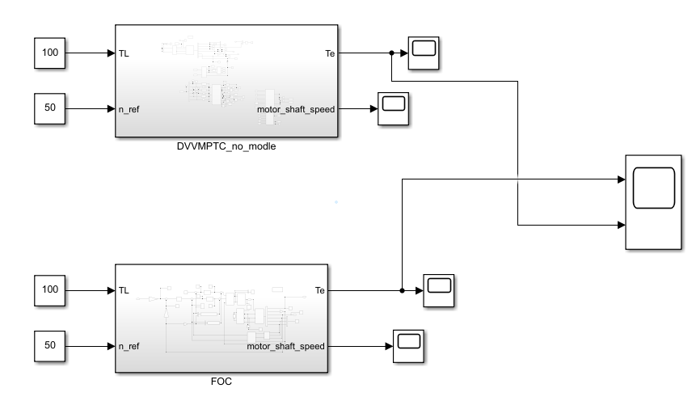
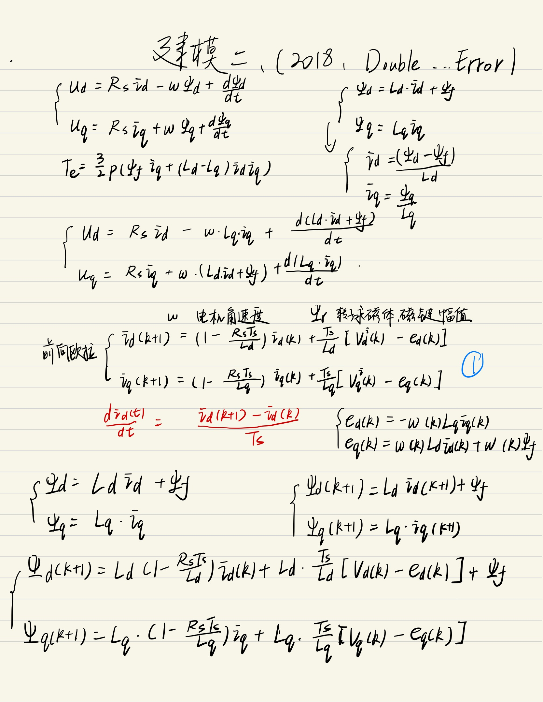
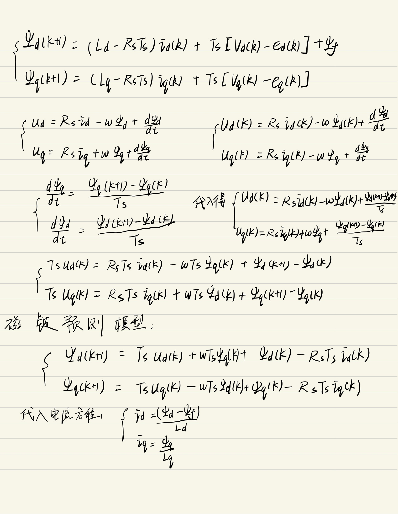
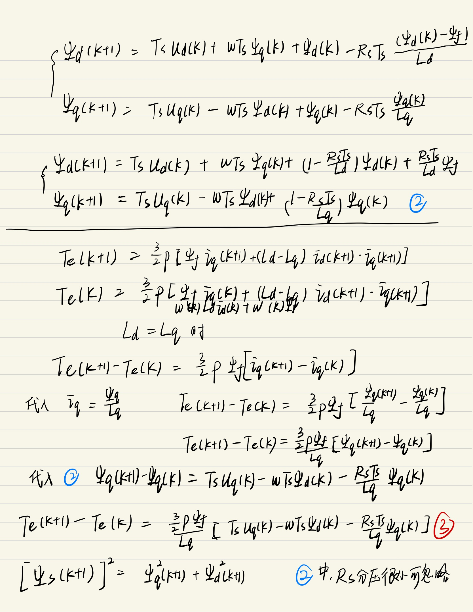
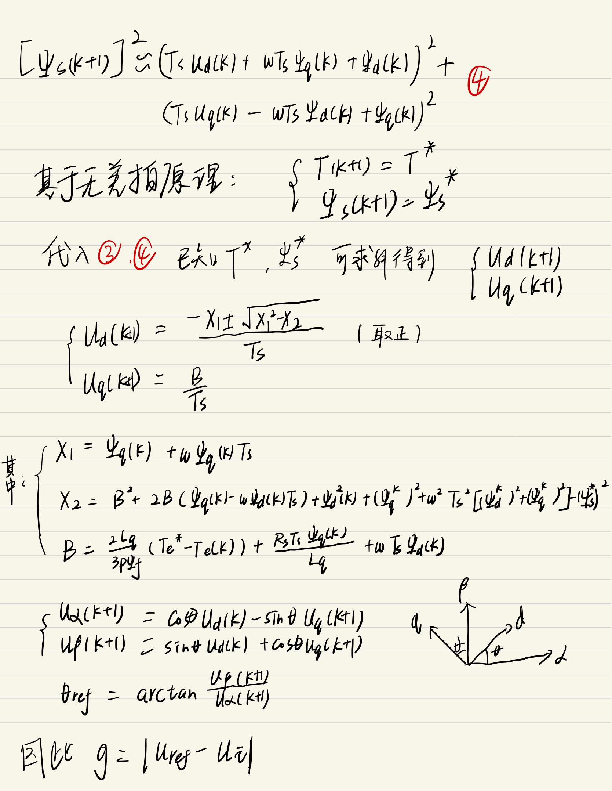

# Double-Vector Model Predictive Torque Control (DV-MPTC) without Weighting Factor

This repository contains the **Simulink implementation** of an advanced Model Predictive Torque Control (MPTC) strategy for Permanent Magnet Synchronous Motors (PMSM).

The project reproduces and improves upon the method proposed in the IEEE TIE paper: *"Double Vectors Model Predictive Torque Control Without Weighting Factor Based on Voltage Tracking Error"*.

> **Keywords**: PMSM, Model Predictive Control (MPC), Torque Ripple Suppression, Weighting Factor Elimination, MATLAB/Simulink

## 📖 Project Overview

### The Problem
Conventional MPTC suffers from two main challenges:
1.  **Weighting Factor Tuning**: The cost function typically mixes torque and flux errors ($g = |T_e^* - T_e| + \lambda ||\psi_s^*| - |\psi_s||$). Tuning the weighting factor $\lambda$ is tedious and affects stability.
2.  **Computational Burden**: Enumerating all voltage vectors in every control cycle is computationally expensive.
3.  **Steady-State Ripple**: Using a single voltage vector per cycle leads to high torque and flux ripples.

### The Solution (This Implementation)
This project implements a **Dual-Vector** strategy based on **Voltage Tracking Error**:
* **No Weighting Factor**: The cost function is transformed to evaluate the error between the *reference voltage vector* (derived from Deadbeat Control) and *candidate vectors*. Since both terms are voltages, no weighting factor is needed.
* **Double Vectors**: Applies one active vector + one null vector within a single control period to refine the duty cycle, significantly reducing torque ripple compared to traditional methods.

## 🚀 Key Features

* **Deadbeat-Based Prediction**: Utilizes Deadbeat Direct Torque and Flux Control (DB-DTFC) to calculate the ideal reference voltage vector ($u_{ref}$) directly.
* **Simplified Cost Function**:
    $$J = | u_{ref} - u_{candidate} |$$
    Eliminates the need to balance torque (Nm) and flux (Wb) units manually.
* **Duty Cycle Optimization**: Calculates the optimal duration ($t_{opt}$) for the active vector to minimize tracking error.
* **Comparative Analysis**: Includes performance comparisons against traditional FOC (Field Oriented Control) and conventional MPTC.

## 🧠 Control Architecture

The control scheme is implemented in **MATLAB/Simulink**. The core workflow is as follows:

1.  **State Estimation**: Estimate current flux and torque based on feedback currents.
2.  **Reference Generation**: Calculate $u_{ref}$ using DB-DTFC principles to ensure deadbeat response.
3.  **Sector Selection**: Determine the sector of $u_{ref}$ to reduce candidate vectors (from 6 to 2), reducing computational load.
4.  **Vector Selection & Timing**: Select the optimal active vector and calculate its duty cycle.

## 📊 Simulation Results

The proposed DV-MPTC method was validated on a PMSM model and compared with traditional control strategies.

### Torque Ripple Suppression Performance

The following figure illustrates the comparison of torque response. The DV-MPTC method demonstrates significantly reduced torque ripple compared to conventional methods under steady-state operation.

  
   
  <em>Figure 1: Comparison of Torque Response (Top: Torque Ripple, Bottom: Stator Current). The proposed method (Right) shows smoother torque output compared to the baseline.</em>

  
   
  <em>Figure 2: simulink_model.</em>

  
   
  <em>Figure 3: formula derivation.</em>

  
   
  <em>Figure 4: formula derivation.</em>

  
   
  <em>Figure 5: formula derivation.</em>

  
   
  <em>Figure 6: formula derivation.</em>

### Key Observations
* **Fast Dynamic Response**: Inherits the quick dynamic response of MPC during load steps.
* **Lower THD**: The dual-vector application effectively reduces the Total Harmonic Distortion (THD) of the stator current.
* **Robustness**: Maintains performance without the need to retune weighting factors for different operating points.